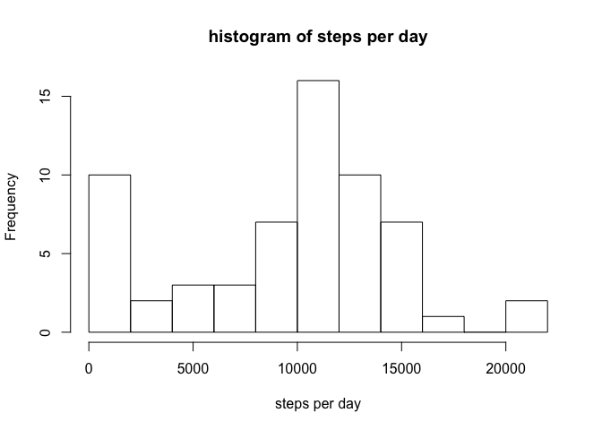
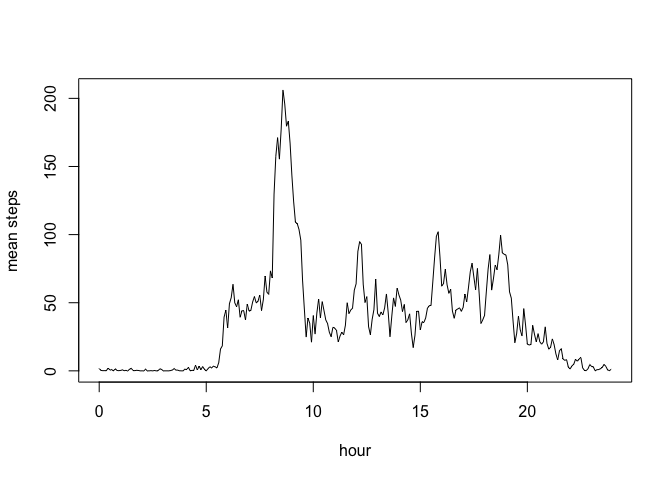
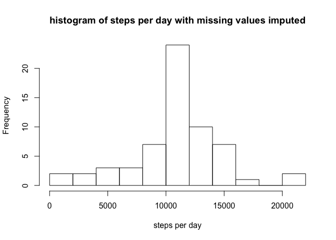
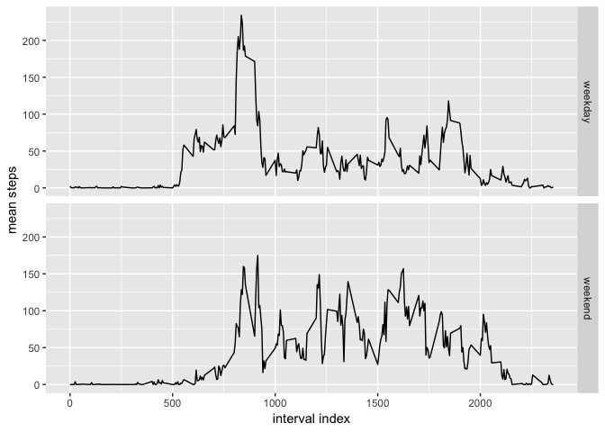

## Loading and preprocessing the data

```r
df = read.csv('activity.csv')
df$date = as.Date(df$date, "%Y-%m-%d")
```

## What is mean total number of steps taken per day?

```r
options(scipen = 1, digits = 2)
step_per_day = tapply(df$steps, df$date, sum, na.rm = TRUE)
median_step_per_day = median(step_per_day, na.rm = TRUE)
mean_step_per_day = mean(step_per_day, na.rm = TRUE)
hist(step_per_day, breaks = 12, xlab = "steps per day", 
     main = "histogram of steps per day")
```

<!-- -->

Mean of the total number of steps per day is: 9354.23  
Median of the total number of steps per day is: 10395  

## What is the average daily activity pattern?


```r
step_interval = tapply(df$steps, df$interval, mean, na.rm = TRUE)
interval_vector = seq(0, 24, 1/12)[1: length(step_interval)]
plot(interval_vector, step_interval, type = 'l', xlab = "hour", ylab = "mean steps")
```

<!-- -->

Q: Which 5-minute interval, on average across all the days in the dataset, contains the maximum number of steps?  

```r
which(step_interval == max(step_interval))
```

```
## 835 
## 104
```
The interval index 835 (most likely starting from 8:35), the 104th interval of the day, contains the maximum number of steps.

## Imputing missing values

```r
# Note that there is only missing value in the steps
missing_rows = is.na(df$steps)
total_missing_rows = sum(missing_rows)
```

The total number of missing values in the steps is 2304


```r
# Impute using the mean of the 5-minute interval
imputing_candidates = rep(step_interval, length(step_per_day))
df_imputed = df
df_imputed[missing_rows, 'steps'] = imputing_candidates[missing_rows]
# Compute the total steps per day using imputed data frame
step_per_day2 = tapply(df_imputed$steps, df$date, sum, na.rm = TRUE)
median_step_per_day2 = median(step_per_day2, na.rm = TRUE)
mean_step_per_day2 = mean(step_per_day2, na.rm = TRUE)
hist(step_per_day2, breaks = 12, xlab = "steps per day", 
     main = "histogram of steps per day with missing values imputed")
```

<!-- -->

After imputation:  
Mean of the total number of steps per day is: 10766.19  
Median of the total number of steps per day is: 10766.19  
The major difference is that there is much less days with total step ~ 0. As a result, the mean step per day increases significantly and the median increases slightly. 

## Are there differences in activity patterns between weekdays and weekends?


```r
# Create a new factor variable with two levels – “weekday” and “weekend”,
# indicating whether a given date is a weekday or weekend day.
library(ggplot2)
df$weekday = weekdays(df$date, abbreviate = TRUE)
weekend = df$weekday %in% c('Sat', 'Sun')
df[weekend, 'weekday'] = 'weekend'
df[!weekend, 'weekday'] = 'weekday'
df$weekday = as.factor(df$weekday)

# Plot the time series plot for weekday and weekend
step_interval = tapply(df$steps, df$interval, mean, na.rm = TRUE)
step_interval_weekday = aggregate(steps ~ interval + weekday, data = df, mean, na.rm = TRUE)
ggplot(step_interval_weekday, aes(interval, steps)) + 
    geom_line() + 
    facet_grid(weekday ~. ) + 
    xlab("interval index") + 
    ylab("mean steps")
```

<!-- -->

